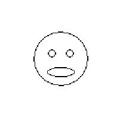
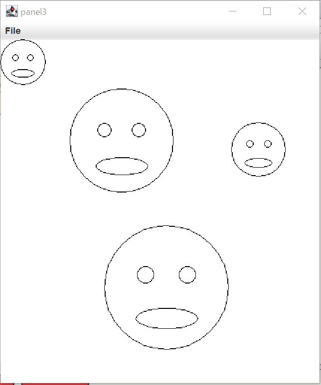
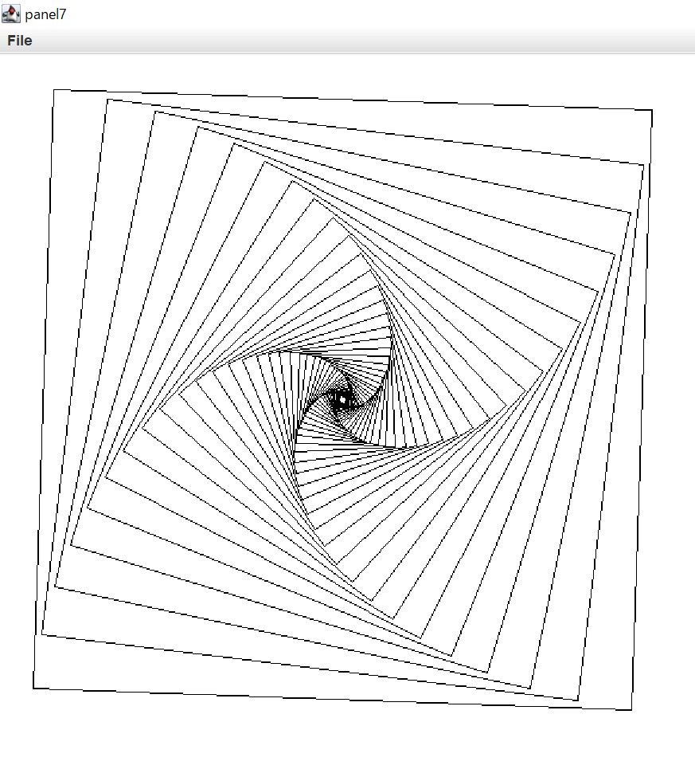

# Java_3
今までに作成したJavaのプログラムを公開しています。

## FunnyFace.java / FunnyPressed.java / RisingFunny.java
FunnyFace.javaは人の表情をデフォルメした画像を示すクラスです。FunnyFacePressed.javaはクリックした場所にこの顔の画像を表示します。RisingFunny.javaでは画面に表示された顔の画像がクリックするたびに上昇していきます。

## FunnyFace2.java / FlexibleFace.java
FunnyFace.javaでは顔の大きさは一定でしたが、FunnyFace2.javaではプログラムによって変化できるようになっています。FlexibleFace.javaでは、利用者がドラッグした大きさの顔がキャンバスに表示されます。

## Spiral.java / Roop.java
次の図のような画像を描画するプログラムです。Roop.javaは角度を変えながら正方形をかくためのクラスです。Whileループを使っています。

## BouncingBall.java / BoucingBallController.java
クリックした場所にボールが生成され、画面上を動くプログラムです。BoucingBall.javaは動くボールを描くためのクラス、BoucingBallCotroller.javaがプログラムです。ボールはキャンバスの四辺にぶつかると跳ね返り動き続けます。
